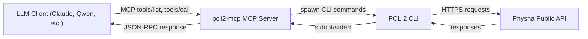

# pcli2-mcp

Oranda docs: https://jchultarsky101.github.io/pcli2-mcp/

[](https://jchultarsky101.github.io/pcli2-mcp/)
[](LICENSE)
[](https://github.com/jchultarsky101/pcli2-mcp/actions/workflows/ci.yml)
[](https://github.com/jchultarsky101/pcli2-mcp/releases)

A lightweight Model Context Protocol (MCP) server over HTTP that wraps the PCLI2 CLI.
It exposes PCLI2 capabilities as MCP tools so LLM clients can list assets/folders
and run geometric match queries through a single JSON-RPC endpoint.

Project links:

- `pcli2-mcp`: https://github.com/jchultarsky101/pcli2-mcp
- `pcli2`: https://github.com/jchultarsky101/pcli2

**Status:** early development (v0.1.15).

## Main Concepts

PCLI2 (Physna Command Line Interface v2) is the official CLI for the Physna public API, focused on 3D geometry search and asset/folder operations. This project is an MCP wrapper around PCLI2: it runs PCLI2 commands behind an MCP JSON-RPC interface so clients like Claude or Qwen can invoke the same capabilities programmatically. For PCLI2 documentation and usage, see the PCLI2 docs site: https://jchultarsky101.github.io/pcli2/ and the repository: https://github.com/jchultarsky101/pcli2.

In short, the flow looks like this:

1. An LLM client (Claude, Qwen, or another MCP-capable app) sends a tool request.
2. `pcli2-mcp` translates that request into a PCLI2 CLI call.
3. PCLI2 talks to the Physna API and returns results.
4. `pcli2-mcp` returns the structured response back to the LLM client.

This keeps your LLM integration stable (MCP over HTTP) while the underlying CLI (PCLI2) remains the single source of truth for Physna API behavior.



## Quick Start

1. Install PCLI2 (version 2.0 or newer) and authenticate.
   Follow the PCLI2 docs and make sure `pcli2` is on your `PATH`: https://jchultarsky101.github.io/pcli2/
   Set `PCLI2_BIN` to point at a specific binary if it is not on the `PATH`.
2. Install `pcli2-mcp` (see Installation below).
3. Run the server:

   ```bash
   pcli2-mcp serve --host localhost --port 8080 --log-level info
   ```
4. Verify the server is healthy:

   ```bash
   curl -s http://localhost:8080/health
   ```
5. Validate MCP is responding (list tools):

   ```bash
   curl -s http://localhost:8080/mcp \
     -H "Content-Type: application/json" \
     -d '{
       "jsonrpc": "2.0",
       "id": 1,
       "method": "tools/list",
       "params": {}
     }'
   ```
6. Generate a client config snippet:

   ```bash
   pcli2-mcp config --client claude --host localhost --port 8080
   ```
7. Paste the snippet into your client (see the sections below).

## Installation

Recommended (pre-built binaries):

1. Download the latest release for your platform from:
   https://github.com/jchultarsky101/pcli2-mcp/releases
2. Put the `pcli2-mcp` binary somewhere on your `PATH`.

Build from source:

1. Install the Rust toolchain (edition 2024).
2. Build:

   ```bash
   cargo build --release
   ```

   The binary will be at `target/release/pcli2-mcp`.

## Documentation Site (Oranda)

This repository uses Oranda to render a nicer, hosted version of the README.

Local build:

```bash
oranda build
```

Local preview (auto-rebuilds on changes):

```bash
oranda dev
```

The GitHub Pages workflow (`.github/workflows/docs.yml`) publishes the site from `public/`.

## Features

- MCP over HTTP (`/mcp`) with JSON-RPC 2.0
- 60+ MCP tools covering every pcli2 2.x command: tenant, folder, asset, metadata, match/similarity, auth, config, environment, user, cache and doctor
- Declarative tool table: one spec per pcli2 command drives both the advertised JSON schema and the argv, with argument validation (required, enums, numeric ranges) before pcli2 is spawned
- pcli2 is always run non-interactively (`PCLI2_NO_INPUT`, `PCLI2_NO_COLOR`, `PCLI2_NO_UPDATE_CHECK`) with structured errors (`PCLI2_ERROR_FORMAT=json`) rendered into tool error messages
- **Thumbnail caching**: Thumbnails are cached on disk and served via HTTP URLs, avoiding large base64 payloads in MCP responses
- **Thumbnail cleanup tool**: Remove expired thumbnails to free up disk space
- Simple, single-binary Rust server
- Comprehensive test suite (unit tests with an argv case for every tool, plus integration tests against a mock pcli2)
- Modular code architecture (cli, error, mcp, pcli, tools, server, thumbnail)

## Client Setup (Using `config`)

The `config` command prints a ready-to-paste JSON snippet with the MCP server definition:

```bash
pcli2-mcp config --client claude --host localhost --port 8080
```

Use the output in the sections below.

## CLI

Run the server:

```bash
pcli2-mcp serve --host localhost --port 8080 --log-level info
```

Use `--host 0.0.0.0` to listen on all interfaces.

Print client config (pretty JSON):

```bash
pcli2-mcp config --client claude --host localhost --port 8080
```

Command-specific help:

```bash
pcli2-mcp help serve
```

### Claude Desktop

1. Open Claude Desktop and go to Settings > Developer > Edit Config (or open the config file directly).
2. Paste the JSON output under `mcpServers`.
3. Restart Claude Desktop.

Config file locations:

- macOS: `~/Library/Application Support/Claude/claude_desktop_config.json`
- Windows: `%APPDATA%\Claude\claude_desktop_config.json`
- Linux: `~/.config/Claude/claude_desktop_config.json`

### Qwen Code

Qwen Code reads MCP servers from `mcpServers` in `settings.json`. You can configure this via:

1. Edit `.qwen/settings.json` in your project, or `~/.qwen/settings.json` for user scope.
2. Paste the JSON output under `mcpServers`.
3. Restart Qwen Code for the settings to load.

Alternatively, you can add a server with the CLI:

```bash
qwen mcp add --transport http pcli2 http://localhost:8080/mcp
```

### Qwen Agent (Python)

Pass an MCP configuration dictionary (including `mcpServers`) when creating the agent:

```python
from qwen_agent.agents import Assistant

mcp_config = {
    "mcpServers": {
        "pcli2": {
            "command": "npx",
            "args": ["-y", "mcp-remote", "http://localhost:8080/mcp"]
        }
    }
}

agent = Assistant(
    llm=llm_cfg,
    function_list=[mcp_config],
)
```

### MCPHost (Local Ollama)

MCPHost can use a local Ollama model and connect to this MCP server over HTTP.

1. Install Ollama, pull a model, and make sure the daemon is running:

   ```bash
   ollama pull mistral
   ollama serve
   ```

2. Install MCPHost:

   ```bash
   go install github.com/mark3labs/mcphost@latest
   ```

3. Create a config file (preferred locations include `~/.mcphost.yml` or `~/.mcphost.json`) and point it at your local MCP server:

   ```yaml
   # ~/.mcphost.yml
   mcpServers:
     pcli2:
       type: "remote"
       url: "http://localhost:8080/mcp"

   # Use a local model with function-calling support
   model: "ollama:mistral"
   ```

4. Run MCPHost:

   ```bash
   mcphost -m ollama:qwen3 --config ./mcphost.yml
   ```

### Other MCP Clients

Most MCP-compatible clients accept the same `mcpServers` JSON block. Use the output of `pcli2-mcp config` as the server definition and follow your client’s MCP documentation.

## MCP API

The server implements MCP over HTTP with a JSON-RPC 2.0 interface.

- `POST /mcp`
- Methods: `initialize`, `tools/list`, `tools/call`

Example `tools/list`:

```json
{
  "jsonrpc": "2.0",
  "id": 1,
  "method": "tools/list",
  "params": {}
}
```

Example `tools/call` (list assets under `/Julian` as CSV):

```json
{
  "jsonrpc": "2.0",
  "id": 2,
  "method": "tools/call",
  "params": {
    "name": "pcli2",
    "arguments": {
      "resource": "asset",
      "folder_path": "/Julian",
      "format": "csv",
      "headers": true
    }
  }
}
```

## Tools

Notes:

- Tool names mirror the pcli2 command tree: `pcli2_<group>_<command>`.
- Most asset tools require either `uuid` or `path`; most folder tools require either `folder_uuid` or `folder_path`.
- Boolean flags such as `headers`, `pretty`, `metadata`, `progress`, `dry_run` map to the pcli2 flag of the same name. Mutating tools accept `yes` to auto-confirm prompts.
- File and directory arguments (`input`, `output`, `checkpoint`) refer to the filesystem of the host running `pcli2-mcp`.
- Argument values are validated (required keys, enums, numeric ranges) before pcli2 is spawned; violations return a JSON-RPC error without running anything.

| Tool | PCLI2 Command | Required Arguments |
| --- | --- | --- |
| `pcli2` | `pcli2 folder list` / `pcli2 asset list` (legacy combined tool) | `folder_path` or `folder_uuid` when `resource=asset` |
| `pcli2_version` | `pcli2 --version` | none |
| `pcli2_doctor` | `pcli2 doctor` | none |
| `pcli2_tenant_list` | `pcli2 tenant list` | none |
| `pcli2_tenant_get` | `pcli2 tenant get` | none |
| `pcli2_tenant_state` | `pcli2 tenant state` | none |
| `pcli2_tenant_use` | `pcli2 tenant use --name <name>` | `name` (or legacy `tenant_name`) |
| `pcli2_tenant_clear` | `pcli2 tenant clear` | none |
| `pcli2_tenant_metadata_list` | `pcli2 tenant metadata list` | none |
| `pcli2_folder_list` | `pcli2 folder list` | none |
| `pcli2_folder_get` | `pcli2 folder get` | `folder_uuid` or `folder_path` |
| `pcli2_folder_create` | `pcli2 folder create` | `name`, plus `parent_folder_uuid` or `parent_folder_path` |
| `pcli2_folder_delete` | `pcli2 folder delete` | `folder_uuid` or `folder_path` |
| `pcli2_folder_rename` | `pcli2 folder rename` | `name`, plus `folder_uuid` or `folder_path` |
| `pcli2_folder_move` | `pcli2 folder move` | `folder_uuid` or `folder_path`, plus `parent_folder_uuid` or `parent_folder_path` |
| `pcli2_folder_resolve` | `pcli2 folder resolve` | `folder_path` |
| `pcli2_folder_download` | `pcli2 folder download` | `folder_uuid` or `folder_path` |
| `pcli2_folder_upload` | `pcli2 folder upload` | `input`, plus `folder_uuid` or `folder_path` |
| `pcli2_folder_thumbnail` | `pcli2 folder thumbnail` | `folder_uuid` or `folder_path` |
| `pcli2_folder_dependencies` | `pcli2 folder dependencies` | `folder_path` |
| `pcli2_folder_geometric_match` | `pcli2 folder geometric-match` | `folder_path` |
| `pcli2_folder_part_match` | `pcli2 folder part-match` | `folder_path` |
| `pcli2_folder_visual_match` | `pcli2 folder visual-match` | `folder_path` |
| `pcli2_auth_login` | `pcli2 auth login` | `client_id`, `client_secret` |
| `pcli2_auth_logout` | `pcli2 auth logout` | none |
| `pcli2_auth_get` | `pcli2 auth get` | none |
| `pcli2_auth_clear_token` | `pcli2 auth clear-token` | none |
| `pcli2_auth_expiration` | `pcli2 auth expiration` | none |
| `pcli2_asset_list` | `pcli2 asset list` | `folder_uuid` or `folder_path` |
| `pcli2_asset_get` | `pcli2 asset get` | `uuid` or `path` |
| `pcli2_asset_create` | `pcli2 asset create` | `input`, plus `folder_uuid` or `folder_path` |
| `pcli2_asset_create_batch` | `pcli2 asset create-batch` | `input`, plus `folder_uuid` or `folder_path` |
| `pcli2_asset_delete` | `pcli2 asset delete` | `uuid` or `path` |
| `pcli2_asset_download` | `pcli2 asset download` | `uuid` or `path` |
| `pcli2_asset_dependencies` | `pcli2 asset dependencies` | `uuid` or `path` |
| `pcli2_asset_dependency_diff` | `pcli2 asset dependency-diff` | `reference_uuid` or `reference_path`, plus `candidate_uuid` or `candidate_path` |
| `pcli2_asset_geometric_match` | `pcli2 asset geometric-match` | `uuid` or `path` |
| `pcli2_geometric_match` | `pcli2 asset geometric-match` (legacy alias) | `uuid` or `path` |
| `pcli2_asset_part_match` | `pcli2 asset part-match` | `uuid` or `path` |
| `pcli2_asset_visual_match` | `pcli2 asset visual-match` | `uuid` or `path` |
| `pcli2_asset_text_match` | `pcli2 asset text-match` | `text` |
| `pcli2_asset_similarity` | `pcli2 asset similarity` | `reference_uuid` or `reference_path`, plus `candidate_uuid` or `candidate_path` |
| `pcli2_asset_reprocess` | `pcli2 asset reprocess` | `uuid` or `path` |
| `pcli2_asset_counts` | `pcli2 asset counts` | none |
| `pcli2_asset_inventory` | `pcli2 asset inventory` | none |
| `pcli2_asset_thumbnail` | `pcli2 asset thumbnail` | `uuid` or `path` |
| `pcli2_asset_metadata_get` | `pcli2 asset metadata get` | `uuid` or `path` |
| `pcli2_asset_metadata_create` | `pcli2 asset metadata create` | `name`, `value`, plus `uuid` or `path` |
| `pcli2_asset_metadata_delete` | `pcli2 asset metadata delete` | `name`, plus `uuid` or `path` |
| `pcli2_asset_metadata_create_batch` | `pcli2 asset metadata create-batch` | `input` |
| `pcli2_asset_metadata_inference` | `pcli2 asset metadata inference` | `path`, `name` |
| `pcli2_config_get` | `pcli2 config get` | none |
| `pcli2_config_get_path` | `pcli2 config get path` | none |
| `pcli2_config_validate` | `pcli2 config validate` | none |
| `pcli2_config_export` | `pcli2 config export` | none |
| `pcli2_config_import` | `pcli2 config import` | none |
| `pcli2_environment_list` | `pcli2 env list` | none |
| `pcli2_environment_get` | `pcli2 env get` | none |
| `pcli2_environment_use` | `pcli2 env use --name <name>` | `name` |
| `pcli2_environment_add` | `pcli2 env add --name <name> [--api-url ...] [--ui-url ...] [--auth-url ...]` | `name` |
| `pcli2_environment_remove` | `pcli2 env remove --name <name>` | `name` |
| `pcli2_environment_reset` | `pcli2 env reset` | none |
| `pcli2_user_list` | `pcli2 user list` | none |
| `pcli2_user_get` | `pcli2 user get <user_id>` | `user_id` |
| `pcli2_cache_clear` | `pcli2 cache clear` | none |
| `pcli2_thumbnail_cache_cleanup` | Cleanup expired thumbnails in the MCP server's cache | none |

Run `tools/list` for the full argument schema of each tool.

Example:

```json
{
  "jsonrpc": "2.0",
  "id": 3,
  "method": "tools/call",
  "params": {
    "name": "pcli2_geometric_match",
    "arguments": {
      "path": "/Root/Folder/Part.stl",
      "threshold": 85,
      "format": "csv",
      "headers": true
    }
  }
}
```

## Thumbnail Cache

The `pcli2_asset_thumbnail` tool uses a disk-based cache to serve thumbnails efficiently. It supports two response modes via the `response_mode` parameter.

> **⚠️ Recommended: Use `response_mode="url"` (default)**
>
> For LLM workflows, **always prefer `url` mode**. It returns a short HTTP URL (~200 tokens) that the client fetches automatically. The `data_url` mode returns ~50K tokens of base64 data, which LLMs often mangle, truncate, or re-encode incorrectly.

### Response Modes

| Mode | Description | Token Usage | When to Use |
|------|-------------|-------------|-------------|
| `url` (default) | Returns an HTTP URL like `http://localhost:8080/thumbnail/:cache_key` | ~200 tokens | **Recommended for all LLM workflows.** The client fetches the image via HTTP automatically. Images render correctly in markdown without LLM handling the image data. |
| `data_url` | Returns a base64 data URI like `data:image/png;base64,...` | ~50K tokens | **Not recommended for LLM use.** Only use when the client cannot make HTTP requests. LLMs often corrupt large base64 strings, causing broken or mangled images. |

### Usage Examples

**Efficient mode (default, recommended):**
```json
{
  "jsonrpc": "2.0",
  "id": 4,
  "method": "tools/call",
  "params": {
    "name": "pcli2_asset_thumbnail",
    "arguments": {
      "path": "/Root/Folder/Part.stl"
    }
  }
}
```

**Self-contained mode (not recommended for LLM):**
```json
{
  "jsonrpc": "2.0",
  "id": 4,
  "method": "tools/call",
  "params": {
    "name": "pcli2_asset_thumbnail",
    "arguments": {
      "path": "/Root/Folder/Part.stl",
      "response_mode": "data_url"
    }
  }
}
```

### How It Works

When you call `pcli2_asset_thumbnail`:
1. The server generates the thumbnail using PCLI2
2. Saves it to the cache directory with metadata
3. Returns an HTML snippet with an `` tag pointing to either:
   - A cached HTTP URL (`response_mode="url"`) - **recommended**
   - An embedded base64 data URI (`response_mode="data_url"`) - **not recommended for LLM**

### Cache Details

- **Cache location**: `~/.pcli2-mcp/thumbnails/`
- **Default TTL**: 24 hours
- **HTTP endpoint**: `http://localhost:PORT/thumbnail/:cache_key`

### Cleaning Up Expired Thumbnails

Use the `pcli2_thumbnail_cache_cleanup` tool to remove expired thumbnails and free up disk space:

```json
{
  "jsonrpc": "2.0",
  "id": 4,
  "method": "tools/call",
  "params": {
    "name": "pcli2_thumbnail_cache_cleanup",
    "arguments": {}
  }
}
```

## Configuration

- `--port`: listening port (default: `8080`)
- `--log-level`: logging level for the server (default: `info`)
- `RUST_LOG`: log level (e.g. `info`, `debug`)

## Troubleshooting

- Ensure `pcli2` is installed and reachable via `PATH`.
- If the server returns a non-zero error, check the embedded `pcli2` stdout/stderr in the response.
- For verbose logging during troubleshooting, set `RUST_LOG=debug`.

## Contributing

Issues and pull requests are welcome. If you plan significant changes, open an issue first
so we can discuss scope and approach.

## Getting Help

Open an issue with a clear repro, expected behavior, and logs (set `RUST_LOG=debug` if needed).

## Maintainers

Maintainers are listed in the repository’s contributor/maintainer roster.

## Changelog

See `CHANGELOG.md`.

## License

Apache License 2.0. See `LICENSE` and `NOTICE`.